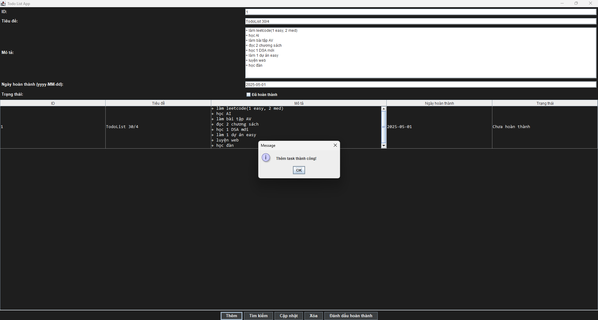
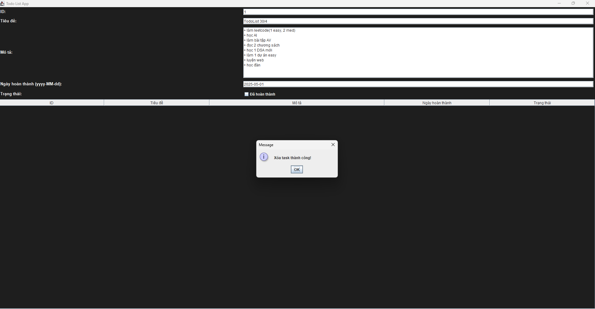
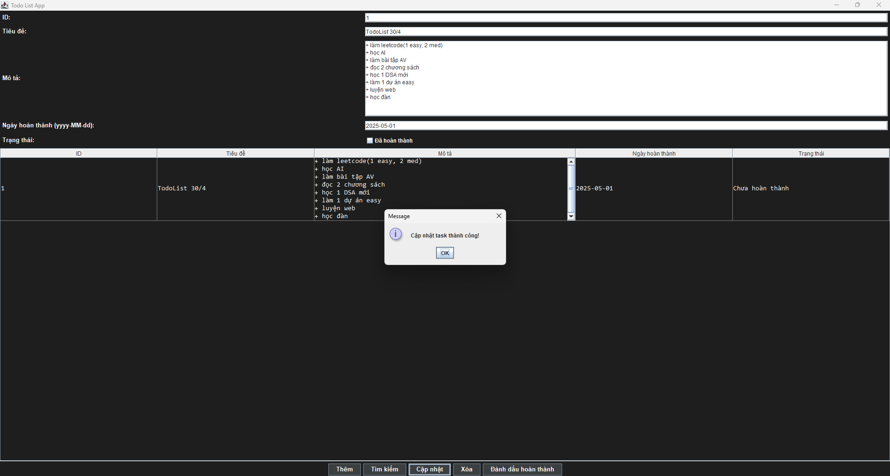
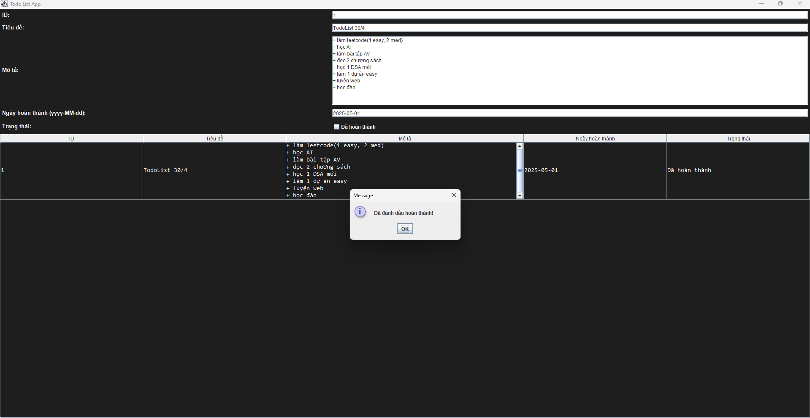

# 📝 TodoList App - Java Swing

Một ứng dụng TodoList đơn giản được xây dựng bằng **Java Swing** và hướng đối tượng (**OOP**), giúp bạn quản lý các công việc hằng ngày một cách hiệu quả và tiện lợi.

---

## 📸 Giao diện người dùng

> _Thêm ảnh chụp màn hình tại đây (ví dụ: ảnh minh họa giao diện chính của ứng dụng)_







---

## ✨ Tính năng nổi bật

- ✅ **Thêm công việc**: Nhập tên công việc và thêm vào danh sách một cách nhanh chóng.
- 🗑️ **Xóa công việc theo ID**: Loại bỏ các công việc không còn cần thiết thông qua ID.
- 📝 **Cập nhật công việc**: Sửa đổi nội dung công việc đã tạo trước đó.
- 🔍 **Tìm kiếm công việc theo ID**: Tìm nhanh một công việc bất kỳ bằng ID duy nhất.
- 🖥️ **Giao diện trực quan**: Thiết kế với Java Swing, thân thiện và dễ sử dụng.

---

## 🧠 Kiến trúc & Công nghệ sử dụng

- 💻 **Ngôn ngữ lập trình**: Java
- 🧱 **Giao diện người dùng**: Java Swing
- 🎯 **Lập trình hướng đối tượng (OOP)**: Phân chia rõ ràng giữa logic xử lý và giao diện, dễ dàng mở rộng và bảo trì.

---

## 🚀 Cách chạy dự án

1. Clone repository:
    ```bash
    git clone https://github.com/NhatTien1114/TodoList.git
    ```

2. Mở dự án bằng IDE Java (Eclipse, IntelliJ IDEA, v.v.).

3. Biên dịch và chạy lớp `Main` để khởi động ứng dụng.

---

## 📂 Cấu trúc thư mục

📦 TodoList ┣ 📂 model # Các lớp đối tượng như Task ┣ 📂 controller # Xử lý logic nghiệp vụ ┣ 📂 view # Giao diện người dùng với Swing ┗ 📜 Main.java # Điểm bắt đầu chương trình

---

## 📌 Ghi chú

> Dự án vẫn đang trong quá trình hoàn thiện. Mọi góp ý hoặc đóng góp đều rất được hoan nghênh!

---

## 📧 Liên hệ

Nếu bạn có bất kỳ câu hỏi hay ý tưởng nào, đừng ngần ngại liên hệ mình qua [Email](mailto:tongnguyennhattien140805@gmail.com) hoặc tạo một issue trên GitHub nhé.

---

> _Made with ❤️ by [Nhật Tiến]_
